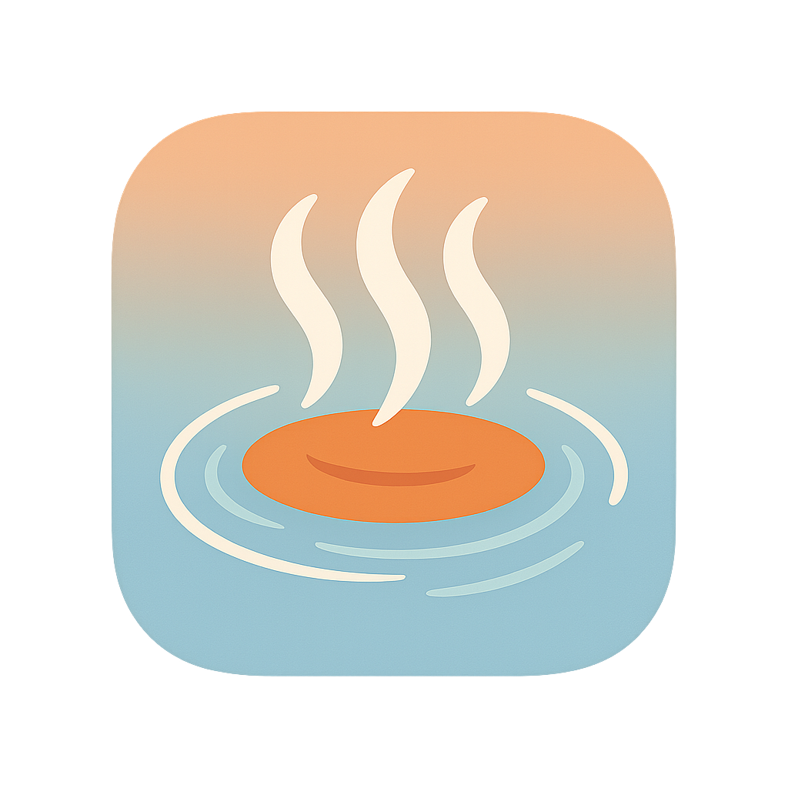

# yumegury

<!-- プロジェクトのスクリーンショットやロゴなど -->
<p align="center">
  
</p>

<p align="center">
  <b>湯けむりを巡る旅へ。あなただけの温泉・スパ記録帳。</b>
</p>

---

## 概要

`yumegury` は、訪れた温泉やスパの体験を記録し、共有するためのクロスプラットフォーム・モバイルアプリケーションです。ExpoとReact Nativeをベースに構築されており、iOS, Android, そしてWebで動作します。

## ✨ 主な機能

- **温泉・スパの記録**: 泉質、温度、感想などを写真と共に記録できます。
- **クロスプラットフォーム**: 一つのコードベースでiOS、Android、Webに対応します。
- **テーマ対応**: ライトモードとダークモードをサポートし、目に優しい体験を提供します。
- **UIコンポーネント**: [Tamagui](https.tamagui.dev/) を利用した、パフォーマンスが高く美しいUI。
- **ファイルベースルーティング**: [Expo Router](https://docs.expo.dev/router/introduction/) による直感的な画面遷移管理。

## 🛠 技術スタック

- **フレームワーク**: [React Native](https://reactnative.dev/), [Expo](https://expo.dev/)
- **UIキット**: [Tamagui](https://tamagui.dev/)
- **言語**: [TypeScript](https://www.typescriptlang.org/)
- **ルーティング**: [Expo Router](https://docs.expo.dev/router/introduction/)
- **パッケージ管理**: [npm](https://www.npmjs.com/) or [Yarn](https://yarnpkg.com/)

## 🚀 利用方法

### 1. 依存関係のインストール

```bash
npm install
```
または
```bash
yarn install
```

### 2. 開発サーバーの起動

```bash
npx expo start
```

ターミナルに表示されるQRコードをExpo Goアプリでスキャンするか、シミュレータを選択してアプリを起動します。

## 📁 ディレクトリ構成

```
.
├── app/              # アプリケーションの画面とルーティング
│   ├── (tabs)/       # タブナビゲーションの各画面
│   └── _layout.tsx   # ルートレイアウト
├── assets/           # フォントや画像などの静的リソース
├── components/       # 再利用可能なUIコンポーネント
├── constants/        # 色やスタイルなどの定数
├── hooks/            # カスタムフック
└── ...
```

## 🙌 貢献

このプロジェクトへの貢献を歓迎します！バグ報告や機能提案は、GitHubのIssuesにお願いします。プルリクエストも歓迎です。

貢献方法の詳細は、`CONTRIBUTING.md`（未作成）を参照してください。

## 📄 ライセンス

このプロジェクトは [MIT License](LICENSE) のもとで公開されています。
